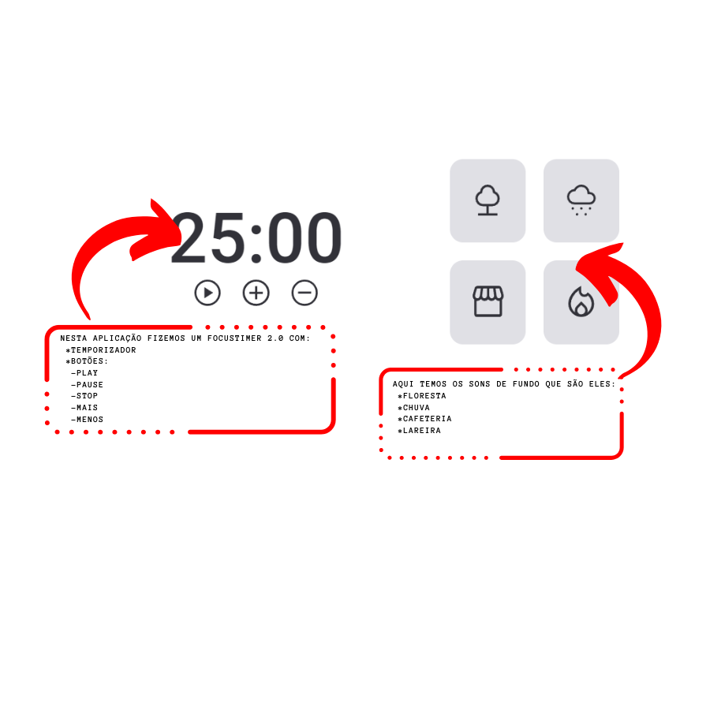

<h1 align="center"> Focus Timer 2.0 </h1>

 Projeto feito inteiramente para RocketSeat

  

## TEMAS
Nesse projeto foram utilizados vários temas:

- Estrutura de dados HTML
- Animações com CSS
- Funções no Javascript
- Lógica do countdown
- Tags
- Estados de aplicações
- ES6 modules

## Projeto 

A aplicação do FocusTimer 2.0 explora o conceito de estados para controlar o tempo decorrido e a contagem regressiva do timer. Utilizaremos variáveis para armazenar informações importantes e atualizar dinamicamente o nosso timer.

- Caso queira acessar o projeto, clique no ícone abaixo: 

     

  

---

by ROCKETSEAT

[Conheça nossa comunidade.](https://discord.gg/rocketseat)
